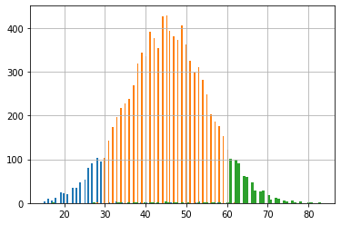

```python
import pandas as pd
from scipy import stats
import scipy.stats as ss
```

Задача:\

У вас есть несколько ресторанов в разных частях города и целый штат курьеров. Но есть одна проблема — к вечеру скорость доставки падает из-за того, что курьеры уходят домой после рабочего дня, а количество заказов лишь растет. Это приводит к тому, что в момент пересмены наша доставка очень сильно проседает в эффективности. 

Наши data scientist-ы придумали новый алгоритм, который позволяет курьерам запланировать свои последние заказы перед окончанием рабочего дня так, чтобы их маршрут доставки совпадал с маршрутом до дома. То есть, чтобы курьеры доставляли последние свои заказы за день как бы "по пути" домой. 

Вы вместе с командой решили раскатить A/B тест на две равные группы курьеров. Часть курьеров использует старый алгоритм без опции "по пути", другие видят в своем приложении эту опцию и могут ее выбрать. Ваша задача – проанализировать данные эксперимента и помочь бизнесу принять решение о раскатке новой фичи на всех курьеров.


```python
df = pd.read_csv('/mnt/HC_Volume_18315164/home-jupyter/jupyter-j-postnova/experiment_lesson_4.csv')
```


```python
df
```


<div>
<style scoped>
    .dataframe tbody tr th:only-of-type {
        vertical-align: middle;
    }

    .dataframe tbody tr th {
        vertical-align: top;
    }

    .dataframe thead th {
        text-align: right;
    }
</style>
<table border="1" class="dataframe">
  <thead>
    <tr style="text-align: right;">
      <th></th>
      <th>order_id</th>
      <th>delivery_time</th>
      <th>district</th>
      <th>experiment_group</th>
    </tr>
  </thead>
  <tbody>
    <tr>
      <th>0</th>
      <td>3159</td>
      <td>44.0</td>
      <td>Purlieus</td>
      <td>control</td>
    </tr>
    <tr>
      <th>1</th>
      <td>10426</td>
      <td>51.0</td>
      <td>Purlieus</td>
      <td>control</td>
    </tr>
    <tr>
      <th>2</th>
      <td>9155</td>
      <td>46.0</td>
      <td>Purlieus</td>
      <td>control</td>
    </tr>
    <tr>
      <th>3</th>
      <td>10699</td>
      <td>34.0</td>
      <td>Purlieus</td>
      <td>control</td>
    </tr>
    <tr>
      <th>4</th>
      <td>10061</td>
      <td>43.0</td>
      <td>Purlieus</td>
      <td>control</td>
    </tr>
    <tr>
      <th>...</th>
      <td>...</td>
      <td>...</td>
      <td>...</td>
      <td>...</td>
    </tr>
    <tr>
      <th>20191</th>
      <td>14561</td>
      <td>42.0</td>
      <td>Suburb</td>
      <td>test</td>
    </tr>
    <tr>
      <th>20192</th>
      <td>12015</td>
      <td>32.0</td>
      <td>Suburb</td>
      <td>test</td>
    </tr>
    <tr>
      <th>20193</th>
      <td>20077</td>
      <td>23.0</td>
      <td>Purlieus</td>
      <td>test</td>
    </tr>
    <tr>
      <th>20194</th>
      <td>14861</td>
      <td>41.0</td>
      <td>Central</td>
      <td>test</td>
    </tr>
    <tr>
      <th>20195</th>
      <td>13501</td>
      <td>41.0</td>
      <td>Central</td>
      <td>test</td>
    </tr>
  </tbody>
</table>
<p>20196 rows × 4 columns</p>
</div>


Для начала сформулируем гипотезы для проверки. \
Нулевая гипотеза (H0): Разницы между средним временем доставки в тестовой и контрольной группе нет\
Альтернативная гипотеза (H1): Разница между средним временем доставки в тестовой и контрольной группе есть


```python
#построим гистограммы распредления времени доставки по районам в контрольной и в тестовой группе
```


```python
df.query("experiment_group == 'control'").groupby('district')['delivery_time'].hist(bins=100)

```


    district
    Central     AxesSubplot(0.125,0.125;0.775x0.755)
    Purlieus    AxesSubplot(0.125,0.125;0.775x0.755)
    Suburb      AxesSubplot(0.125,0.125;0.775x0.755)
    Name: delivery_time, dtype: object





```python
df.query("experiment_group == 'test'").groupby('district')['delivery_time'].hist(bins=100)
```


    district
    Central     AxesSubplot(0.125,0.125;0.775x0.755)
    Purlieus    AxesSubplot(0.125,0.125;0.775x0.755)
    Suburb      AxesSubplot(0.125,0.125;0.775x0.755)
    Name: delivery_time, dtype: object


```python
#предварительно по графикам видны различия по времени доставки в разных районах, 
```

Проверим выполнение условий на нормальность и посчитаем стандартное отклонение в тесте и в контроле.
Делаем семплирование перед применением критерия при проверке на нормальность (и для теста, и для контроля), так как на больших выборках вы можете получать неверные результаты: 


```python
from scipy.stats import shapiro
```


```python
shapiro(df[df['experiment_group'] == 'test']['delivery_time'].sample(1000, random_state=17))
```


    ShapiroResult(statistic=0.9975479245185852, pvalue=0.14013493061065674)


```python
shapiro(df[df['experiment_group'] == 'control']['delivery_time'].sample(1000, random_state=17))
```


    ShapiroResult(statistic=0.9974725842475891, pvalue=0.12411931157112122)


Для того, чтобы проверить нормальность распределения, я использую 
SHAPIRO-WILK TEST. \
Этот тест показывает, что значения в тестовой группе распределены НОРМАЛЬНО\
В контрольной группе распределение является НОРМАЛЬНЫМ\
Стандартное отклонение времени доставки в тесте равно (округлите до сотых) 9.88\
Стандартное отклонение времени доставки в контроле равно (округлите до сотых) 9.99

Для сравнения средних в данных экспериментальных группах я использую 
STUDENT'S T-TEST


```python
ss.ttest_ind(df[df['experiment_group'] == 'control']['delivery_time'], df[df['experiment_group'] == 'test']['delivery_time'])
```


    Ttest_indResult(statistic=43.03582663183714, pvalue=0.0)


. Статистика в тесте равна -43, p-value <= 0.05, 

На сколько процентов изменилось среднее время доставки в тестовой группе по сравнению с контрольной?


```python
c = df[df['experiment_group'] == 'control']['delivery_time'].mean()
c
```


    45.065101070154576


```python
t = df[df['experiment_group'] == 'test']['delivery_time'].mean()
t
```


    39.04681314330958


```python
round (100 - t*100/c,2)
```


    13.35


Что в итоге? Используем новую версию? Да, раскатываем новый алгоритм на всех, так как среднее время доставки статистически значимо изменилось. Среднее время доставки в тесте меньше, чем в контроле.
